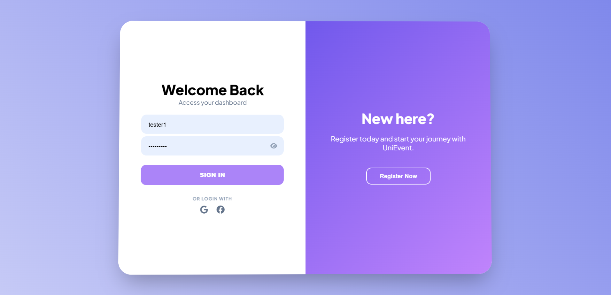
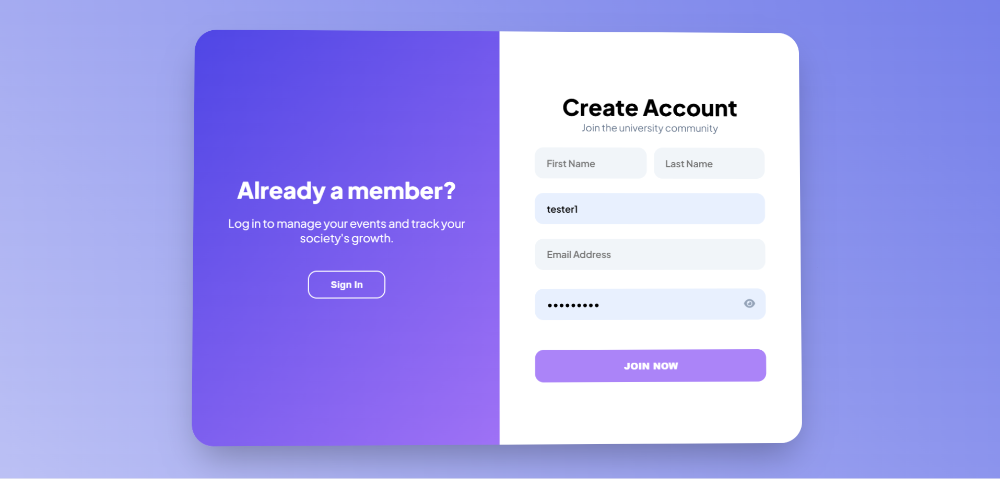
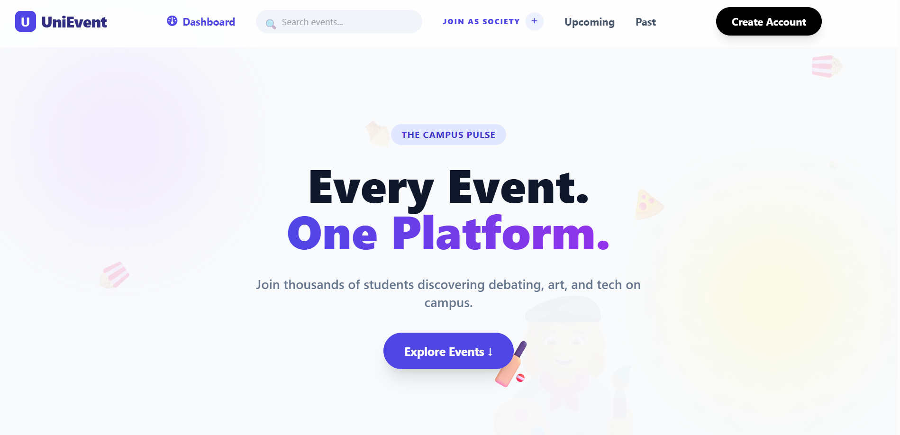

# 🎓 UniEvent — Campus Event Discovery Platform

> **Every Event. One Platform.**

UniEvent is a full-stack web application designed to centralize campus life by providing a **single source of truth for university events**. It eliminates the traditional _poster-scatter_ problem and empowers students, societies, and administrators through a unified digital ecosystem.

---

## 📌 Table of Contents

- [Problem Statement](#-problem-statement)
- [Solution Overview](#-solution-overview)
- [System Architecture](#-system-architecture)
- [Key Features](#-key-features)
- [Screenshots](#-screenshots)
- [Tech Stack](#-tech-stack)
- [Security & Access Control](#-security--access-control)
- [Challenges Overcome](#-challenges-overcome)
- [Future Roadmap](#-future-roadmap)
- [Setup Instructions](#-setup-instructions)

---

## ❓ Problem Statement

Campus engagement is currently **fragmented and inefficient**:

- 📱 Event information is scattered across WhatsApp groups, Instagram stories, and notice boards
- 🎯 Students miss opportunities due to late or missed visibility
- 📢 Societies struggle to reach beyond their existing audience
- 📊 No structured data exists for event engagement or reach

---

## 💡 Solution Overview

**UniEvent** introduces a centralized platform where:

- 🎓 **Students** can discover, like, and engage with events in a modern feed
- 🏛 **Societies** manage and publish events via a professional command center
- 🛡 **Admins** oversee verification, moderation, and system integrity

The platform is designed for **scalability, security, and usability**, making it suitable for real university deployment.

---

## 🧱 System Architecture

### Frontend — _The Experience_

- 🎨 **Modern UI**: Glassmorphic and fully responsive design using Tailwind CSS
- 🧊 **3D Login Experience**: Mouse-tracking parallax effect for immersive interaction
- ⌨️ **Dynamic Typing Effects**: Hero section animations for premium feel
- 🔄 **Live Role Switching**: Seamless transition between Student, Society, and Admin dashboards
- 🛠 Technologies:
  - HTML5
  - JavaScript (ES6+)
  - Tailwind CSS
  - Font Awesome

---

### Backend — _The Core_

- 🧩 **Framework**: Flask (Python) with modular Blueprint architecture
- 🗄 **Database**: SQLAlchemy (SQLite) with complex relationships
  - Many-to-Many mapping for Event Likes
- 🔐 **Security**:
  - Role-Based Access Control (RBAC)
  - Password hashing using Werkzeug
  - Frontend route gatekeeping
- 🔁 **API Design**:
  - RESTful JSON-based API
  - Decoupled frontend-backend architecture

---

## ✨ Key Features

### 1️⃣ Interactive Event Feed

- 👍 Real-time “Interest” (Like) system
- 🔗 Direct links to:
  - Instagram
  - WhatsApp
  - Google Registration Forms
- 🗂 Category-based filtering (Workshops, Socials, Competitions)

---

### 2️⃣ Society Command Center

- 📤 Event publishing with poster upload, venue, and descriptions
- 📈 Engagement analytics (likes & views)
- ✅ Verification status tracking for societies

---

### 3️⃣ Role-Based Access Control (RBAC)

| Role    | Permissions                                       |
| ------- | ------------------------------------------------- |
| Student | View, search, and interact with events            |
| Society | Publish and manage events after verification      |
| Admin   | Verify societies, moderate events, oversee system |

---

## 🖼 Screenshots

### 🔐 Login & Signup




### 📰 Landing Page




### 🏛 Society Dashboard


### 🏛 Society Registration


### 🛡 Admin Panel


---

---

## 🧰 Tech Stack

**Frontend**

- HTML5
- Tailwind CSS
- JavaScript (ES6+)

**Backend**

- Python
- Flask
- SQLAlchemy

**Database**

- SQLite

**Tools**

- Git & GitHub
- VS Code

---

## 🔐 Security & Access Control

- Secure password hashing with Werkzeug
- Frontend route gatekeeping using role validation
- Backend authorization checks for protected routes
- Admin-only access to moderation and verification tools

---

## ⚙️ Challenges Overcome

1. 🎢 Managing real-time 3D parallax state alongside form validation logic
2. 🔗 Implementing efficient Many-to-Many relationships in SQLAlchemy
3. 🛑 Enforcing frontend invisibility of admin/society dashboards for students using access gatekeeping

---

## 🚀 Future Roadmap

- 🔔 Push notifications for followed societies
- 📱 QR-based event check-in system
- 💬 In-app chat between students and society representatives
- 📊 Advanced analytics dashboard for admins

---

## 🛠 Setup Instructions

```bash
# Clone the repository
git clone https://github.com/HaiderAli2027/unievent.git

# Navigate into the project
cd UniEvent-platform

# Create virtual environment
python -m venv .venv
source .venv/bin/activate

#Navigate in backend
cd backend

# Install dependencies
pip install -r requirements.txt


# Run the Flask server
python run.py
```
